<div align="center">

# ☁️ CloudVault — Secure Cloud File Storage Platform

<p align="center">
  
  
  
  
  
</p>

A full-stack enterprise cloud storage platform with JWT-based authentication, OTP email verification, role-based access control, and a powerful admin portal with real-time analytics.

</div>

---

## 🏗️ Architecture of the Project

### High-Level Architecture

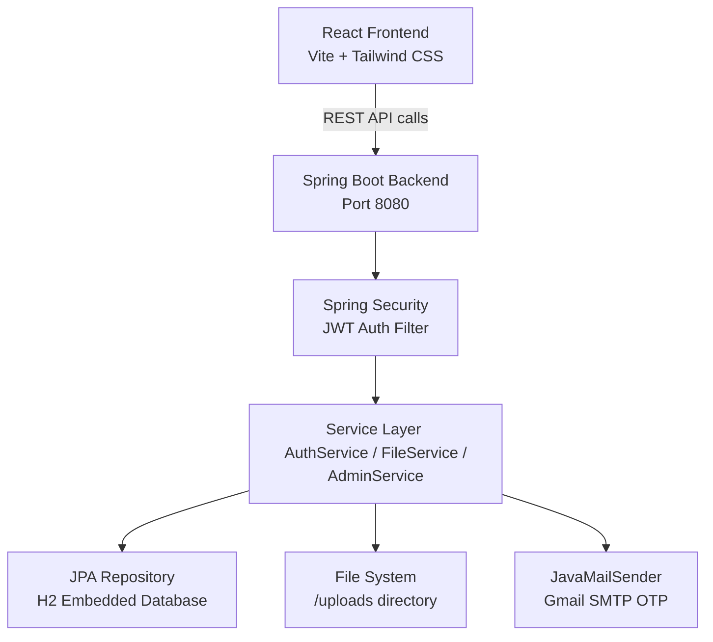

### Request Flow

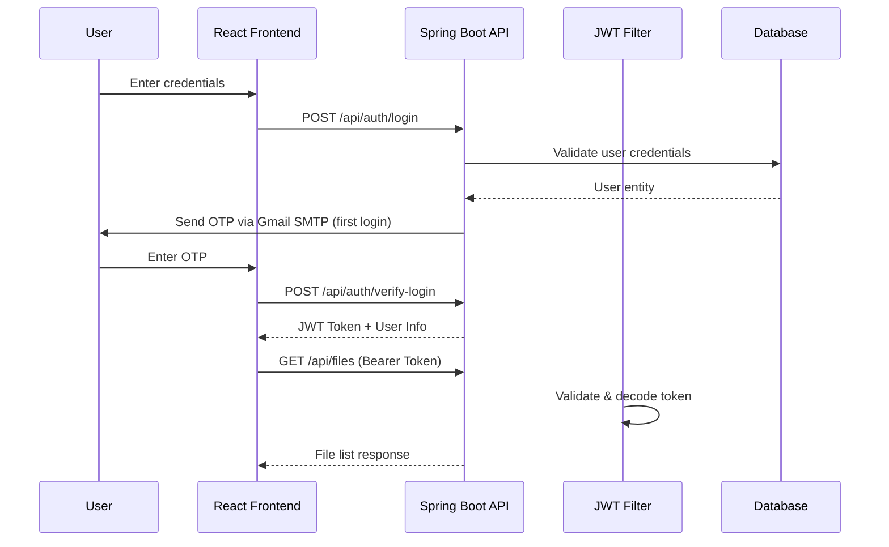

---

## ✨ Core Features

### 👤 User Portal (`/dashboard`)
- Drag & Drop file upload with real-time progress bar (up to 50MB)
- File listing with search, download, and delete
- Overview dashboard with storage stats and file type breakdown
- Notification system and dark/light theme toggle
- Secure password change with auto-logout

### 🛡️ Admin Portal (`/admin`)
- Analytics dashboard with Recharts — Pie, Area, and Bar charts
- User directory with search, role filter, block/unblock, and soft delete
- Archived users panel with restore or permanent delete (cascading disk wipe)
- Global file index across all users with Vault (quarantine) and Restore
- Deep user profile telemetry — login timestamps, storage footprint, file history

### 🔐 Security
- Stateless JWT authentication (24hr expiry)
- First-login OTP email verification via Gmail SMTP
- Forgot password OTP reset flow
- BCrypt password hashing
- Role-based route guards (`ROLE_USER` / `ROLE_ADMIN`)
- File ownership enforcement — users can only access their own files
- Custom confirm modals — zero use of `window.confirm`

---

## 📸 Screenshots

### Authentication
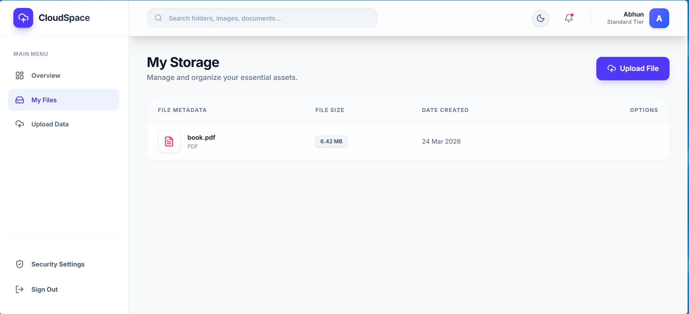
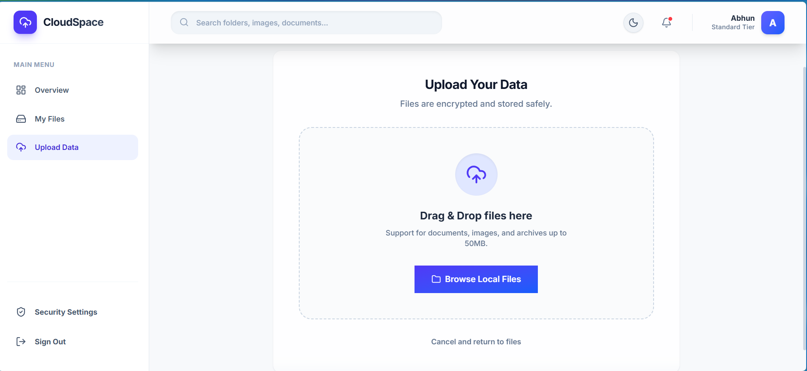
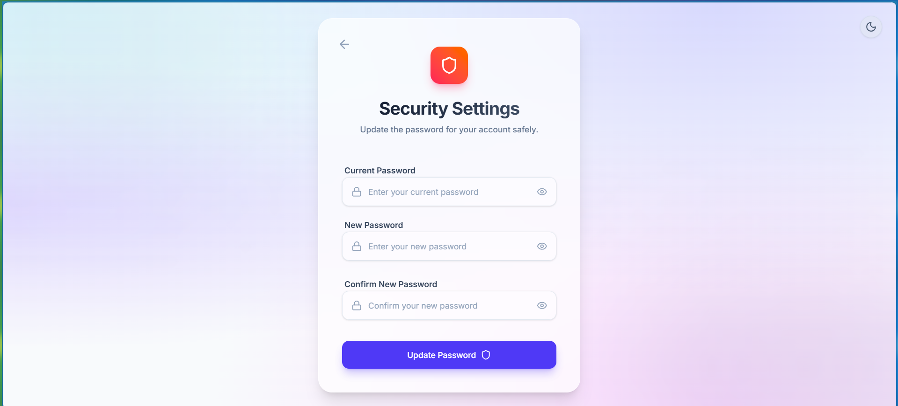

### User Dashboard
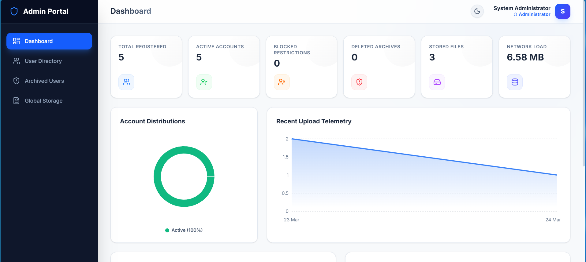
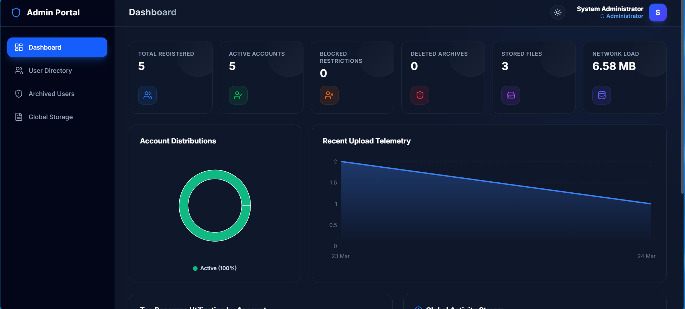
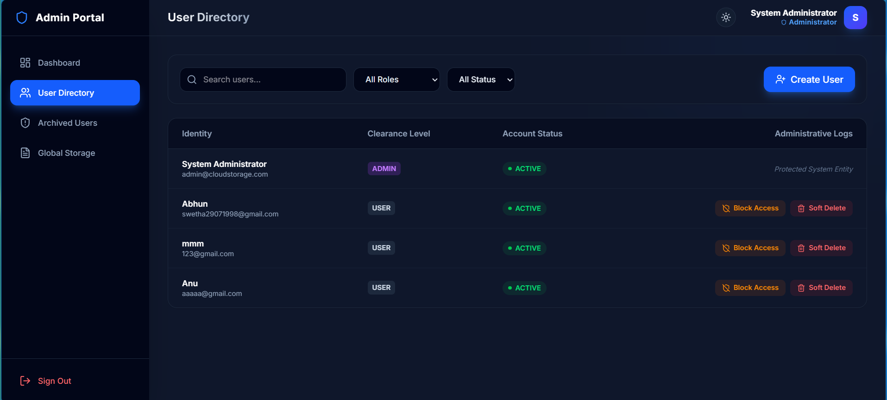

### Admin Portal
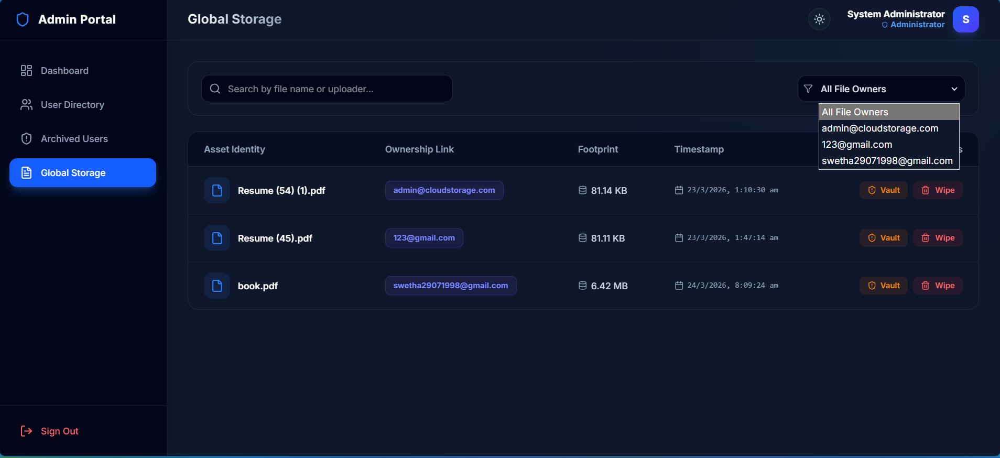
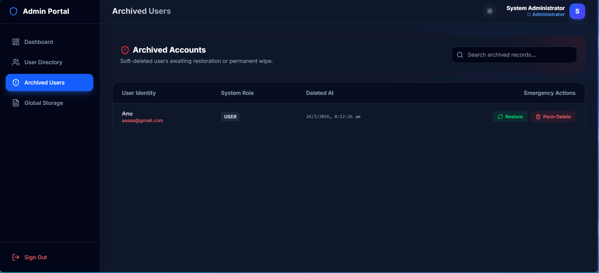
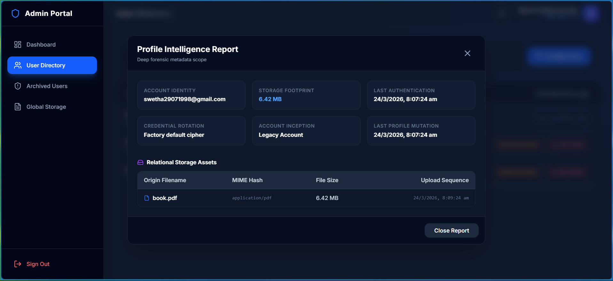

### Admin Deep Features
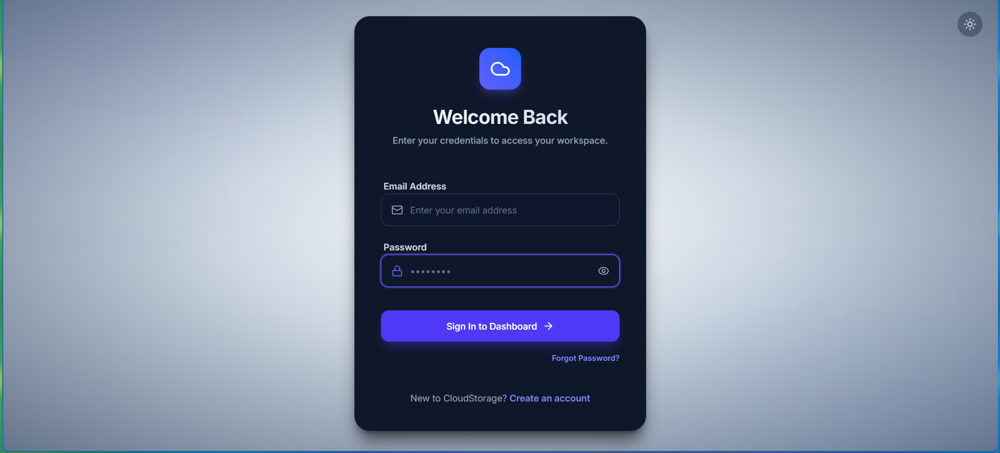
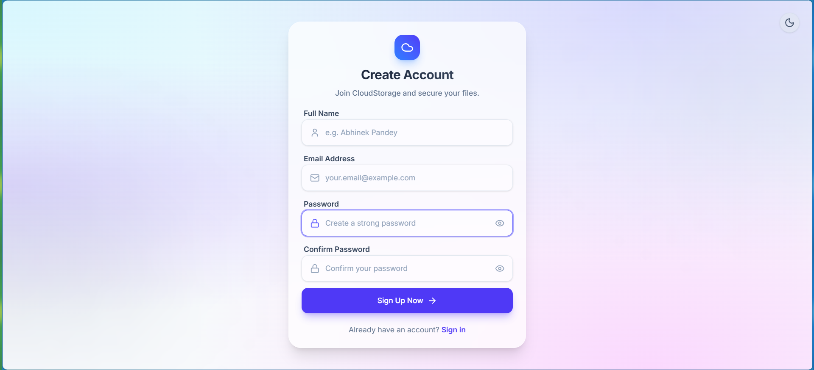
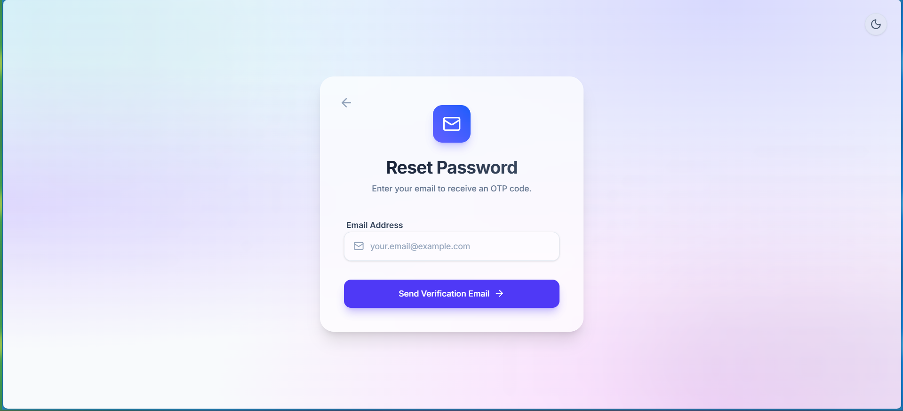

---

## 🚀 Running Locally

### Backend
```bash
cd backend/
./mvnw spring-boot:run
```
> Runs on `http://localhost:8080`. Requires Java 17+.

### Frontend
```bash
cd frontend/
npm install
npm run dev
```
> Runs on `http://localhost:5173`.

### Default Admin Account
On first boot, the system auto-provisions:
```
Email:    admin@cloudstorage.com
Password: admin123
```

### Gmail SMTP (OTP)
Update `backend/src/main/resources/application.properties` with your Gmail credentials and App Password to enable OTP emails.

---

## 🗂️ Project Structure

```
cloud-file-storage/
├── backend/                        # Spring Boot application
│   └── src/main/java/com/cloudstorage/backend/
│       ├── config/                 # Security, CORS, DataInitializer
│       ├── controller/             # Auth, File, Admin REST controllers
│       ├── service/                # Business logic layer
│       ├── entity/                 # User, FileItem JPA entities
│       ├── repository/             # Spring Data JPA repositories
│       ├── security/               # JWT filter & service
│       └── dto/                    # Request/Response DTOs
├── frontend/                       # React + Vite application
│   └── src/
│       ├── pages/                  # Login, Register, Dashboard, Admin pages
│       ├── components/             # ConfirmModal
│       ├── context/                # AuthContext (JWT state)
│       └── api/                    # Axios config with interceptor
├── Screenshot/                     # UI screenshots
├── run_backend.bat                 # Windows backend launcher
├── run_frontend.bat                # Windows frontend launcher
└── docker-compose.yml              # Docker setup (PostgreSQL)
```

---

## 🛠️ Tech Stack

| Layer | Technology |
|---|---|
| Frontend | React 18, Vite, Tailwind CSS 4, Recharts, Lucide Icons |
| Backend | Spring Boot 4, Spring Security, Spring Data JPA |
| Auth | JWT (jjwt 0.12.5), BCrypt, OTP via Gmail SMTP |
| Database | H2 (embedded, file-persisted) |
| File Storage | Local filesystem (`/uploads`) |
| HTTP Client | Axios with Bearer token interceptor |

---

*Built with a focus on enterprise-grade security, clean UI, and full-stack depth.*
